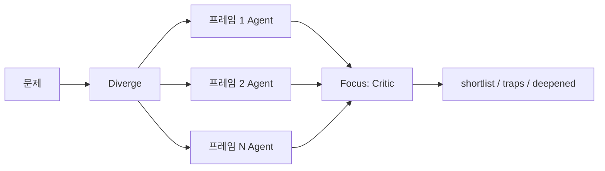

# ADHD 스킬

**ADHD**(Parallel Divergent Ideation for Coding Agents)는 코딩 에이전트가 아이디어를 낼 때 **넓게 발산한 뒤 깊게 수렴**하도록 설계된 스킬·방법론이다. [[Udit Akhouri]] 프리프린트를 [[adhd-agent]] 저장소가 구현한다.

## 해결하려는 문제: 조기 수렴

LLM에 "몇 가지 방법을 제안해줘"라고 하면 첫 가설에 빠르게 고착된다. 자기회귀 구조상 초기 토큰이 이후 전체 추론을 지배한다.

- **CoT** ([[Chain-of-Thought]]): 단일 사슬 → 첫 답에 종속
- **ToT** ([[Tree-of-Thought]]): 가지는 늘리나 **공유 맥락**에서 고착이 전파됨

ADHD는 이를 **프롬프트 튜닝이 아닌 호출 구조** 문제로 본다.

## 두 단계 루프

### Diverge (발산)

1. N개 [[인지 프레임]] 선택 (기본 15종, `documentation/frames.md`)
2. 프레임마다 **독립 Agent 호출** (병렬)
3. 각 호출: 문제 + 해당 프레임 관점만, **평가 금지** 시스템 프롬프트
4. 분기 간 결과 **완전 비공유** → 앵커링(anchoring) 차단

### Focus (수렴)

1. **별도 critic** 호출 (생성기와 반대 시스템 프롬프트)
2. 채점: novelty, viability, fit
3. trap(그럴듯하지만 망가진) 아이디어 표시
4. 유사 아이디어 군집화
5. 상위 K개 심화 (위험 요소 + 1단계 스케치)

## 벤치마크 요약

| 지표 | vs single-shot |
|------|----------------|
| 아이디어 폭 | 1.9× |
| 참신성 | 2.9× |
| 함정 탐지 | **5.2×** |
| 실행 가능성 | 1.5× |

6문제 중 5승. LLM-as-judge 평가이므로 해석 시 `documentation/evals.md` 한계 확인 필요.

## 사용

- 스킬: `npx skills add UditAkhourii/adhd` → `/adhd "..."` 
- CLI/라이브러리: `adhd-agent` (npm)
- 옵션: `--frames`, `--ideas`, `--top`

## 비교 포인트

| | CoT | ToT | ADHD |
|---|-----|-----|------|
| 맥락 공유 | 단일 | 공유 트리 | **프레임별 격리** |
| 비평 | 동일 호출 내 | 트리 내 pruning | **별도 critic 호출** |
| 병렬성 | 낮음 | 중간 | **프레임 단위 병렬** |

## 관련

- [[출처/ADHD 코딩 에이전트 스킬 PyTorchKR]] — 한국어 소개 글
- [[인지 프레임]]
- [[adhd-agent]]
